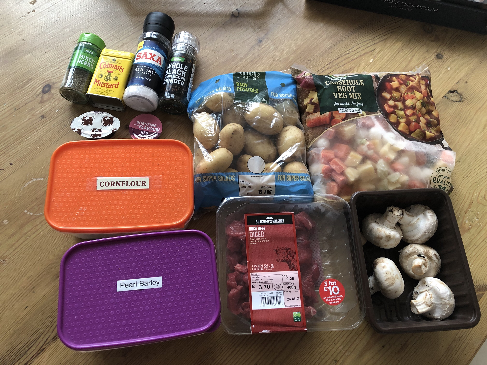
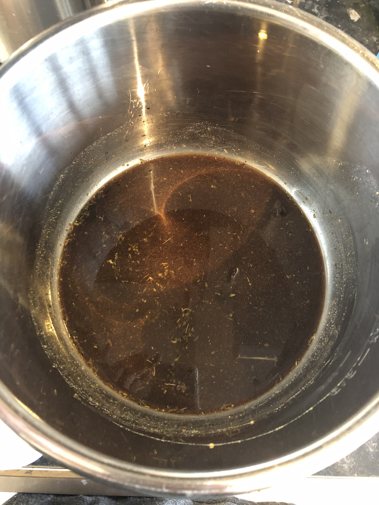
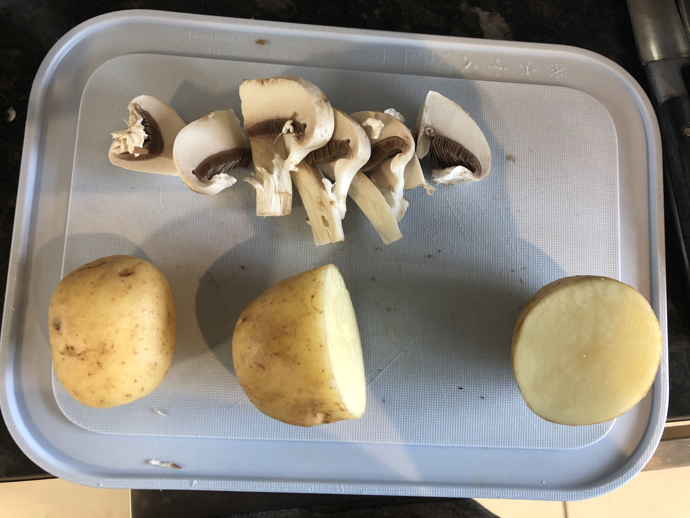
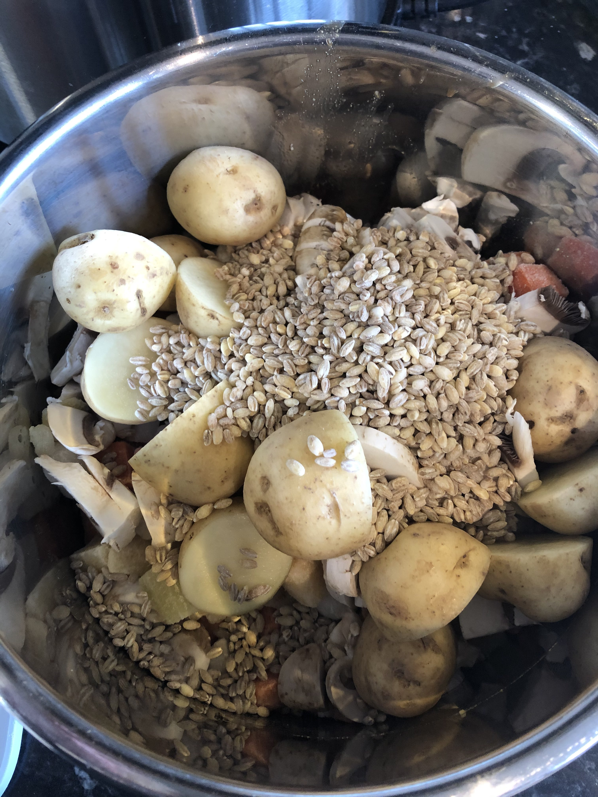
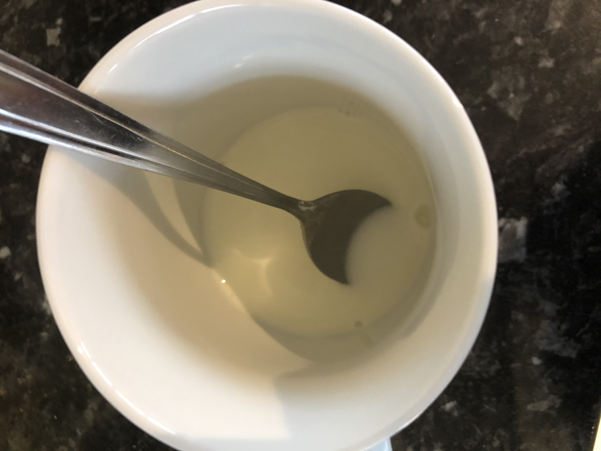

# Beef stew (higher spoons)

Serves 4
Slow-cooker or Instant Pot required.

## Ingredients

- 400g diced beef
- 1 bag frozen casserole veg
- Half bag of baby potatoes
- Half punnet of mushrooms
- 1 cup pearl barley
- 1 rich beef stock pot
- 1 red wine stock pot
- 1/2 tsp salt
- 1/2 tsp pepper
- 1 tsp mixed herbs
- 1 tsp mustard powder
- Hot water: 250ml for IP, 1L for slow cooker

## Recipe

- Add the stock pots, herbs, salt, pepper, mustard and water to the pot and stir to dissolve

- Slice the mushrooms.
- Smaller potatoes leave whole, larger ones cut in half

- Add the meat, veg, mushrooms, potatoes and barley

- Give it a quick stir, then put the lid on.
- **Instant Pot**: cook at high pressure for 45 mins with a 10 minute natural pressure release.
- **Slow cooker**: 8 hours on medium or 4 hours on high
- Mix the cornflour with a small amount of cold water (otherwise you end up with lumps).
- Turn the Instant Pot to sauté or the slow-cooker to high.
- Add the cornflour slurry and stir for a minute or two to thicken.

- Serve

